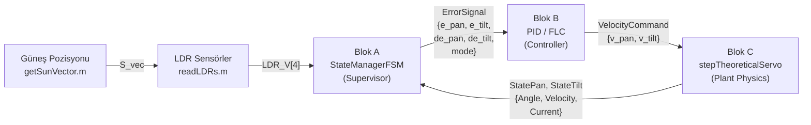
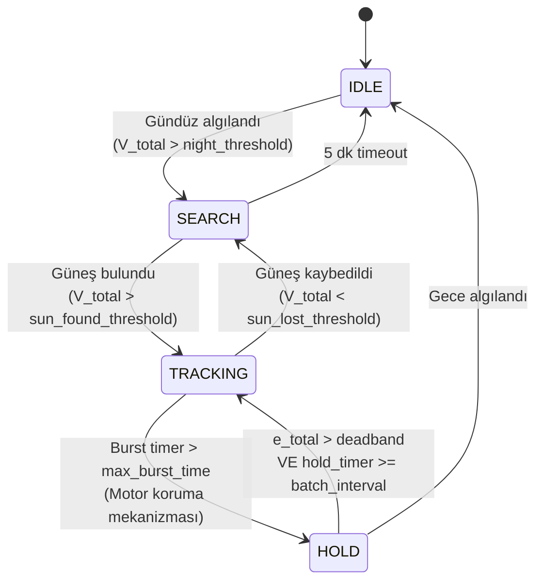

# MATLAB Fiziksel Model Raporu
## Move-and-Sleep Güneş Takip Sistemi — Kapsamlı Teknik Analiz

> **Proje:** Aktüatör enerji tüketimini hesaba katarak "move-and-sleep" stratejisiyle çalışan, çift eksenli, maksimum net enerji verimi hedefleyen yenilikçi bir güneş takip sistemi.  
> **Ana Dosya:** [main_easy.m](file:///c:/Users/Kerem%20Bayer/Desktop/Mikro_Konferans/System_march_extented_analysis/main_easy.m)  
> **Tarih:** 27 Mayıs 2026

---

## 1. Fiziksel Modelin Amacı ve Temel Çalışma Mantığı

Bu MATLAB simülasyonu, **mikro ölçekli (0.04 m²)** bir çift eksenli güneş takip sistemini fiziksel olarak modellemektedir. Sistemin temel yeniliği, klasik "sürekli takip" yerine **"Move-and-Sleep" (Hareket Et ve Uyu)** stratejisini kullanmasıdır:

```
┌─────────────────────────────────────────────────────────────┐
│  TEMEL İDEA: Net Enerji = Panel Üretimi − Motor Tüketimi   │
│                                                             │
│  Sürekli takip → yüksek motor tüketimi → düşük net verim   │
│  Move-and-Sleep → aralıklı takip → yüksek net verim        │
└─────────────────────────────────────────────────────────────┘
```

> [!IMPORTANT]
> Sistemin amacı **brüt enerji üretimini** değil, **net enerji verimini** (panel üretimi − motor tüketimi) maksimize etmektir. Bu, klasik güneş takip sistemlerinden temel farktır.

### 1.1 Sistem Mimarisi: 3-Blok Yapı

Simülasyon, modüler bir **3-Blok mimarisi** kullanır:



| Blok | Dosya | Sorumluluk |
|------|-------|------------|
| **A — Supervisor** | [StateManagerFSM.m](file:///c:/Users/Kerem%20Bayer/Desktop/Mikro_Konferans/System_march_extented_analysis/Controllers/StateManagerFSM.m) | FSM durum yönetimi, hata sinyal üretimi, gece algılama |
| **B — Controller** | [PID_VelocityController.m](file:///c:/Users/Kerem%20Bayer/Desktop/Mikro_Konferans/System_march_extented_analysis/Controllers/PID_VelocityController.m) / [FuzzyLogicController.m](file:///c:/Users/Kerem%20Bayer/Desktop/Mikro_Konferans/System_march_extented_analysis/Controllers/FuzzyLogicController.m) | Hız komutu üretimi (PID veya Mamdani FLC) |
| **C — Plant** | [stepTheoreticalServo.m](file:///c:/Users/Kerem%20Bayer/Desktop/Mikro_Konferans/System_march_extented_analysis/Physics/stepTheoreticalServo.m) | 2. derece servo motor dinamiği, tork, sürtünme |

---

## 2. Sistemin Girdileri (Inputs)

### 2.1 Kullanıcı Konfigürasyonu (main_easy.m, satır 13–25)

| Parametre | Değer | Açıklama |
|-----------|-------|----------|
| `SCENARIO` | `'EXTREME'`, `'REALISTIC'`, `'SOLAR_DAY'` vb. | Test senaryosu seçimi |
| `CONTROL_MODE` | `'pid'` veya `'fuzzy'` | Kontrolcü tipi |
| `PHYSICS_MODEL` | `'THEORETICAL'`, `'COMPLEX'`, `'SIMPLE'` | Fizik modeli seçimi |
| `dt_physics` | 0.01 s | Fizik simülasyon adımı |
| `dt_control` | 0.01 s | Kontrol döngüsü adımı |
| `SimDate` | `datetime(2023, 10, 21, 8, 0, 0)` | Simülasyon başlangıç tarihi |

### 2.2 Güneş Pozisyonu Girdileri

- **PVGIS Verileri:** `YTU_NASA_Hourly.csv`, `ANKARA_Hourly.csv`, `ANTALYA_Hourly.csv` — saatlik ışınım (W/m²)
- **Konum:** İstanbul (41.051°N, 29.010°E, UTC+3)
- **Prepared Data:** `prepared_data_HOURLY_*.mat` — ön işlenmiş .mat dosyaları

### 2.3 Senaryo Parametreleri ([generateScenario.m](file:///c:/Users/Kerem%20Bayer/Desktop/Mikro_Konferans/System_march_extented_analysis/Scenarios/generateScenario.m))

| Senaryo | `spiral_speed` (°/s) | `duration_sec` | Açıklama |
|---------|---------------------|----------------|----------|
| REALISTIC | 0.01 | 300 s | Gerçek güneş hareketi (~0.25 °/dk) |
| VEHICLE_SLOW | 0.05 | 600 s | 12× güneş hızı |
| VEHICLE_FAST | 0.2 | 300 s | 50× güneş hızı |
| EXTREME | 5.0 | 1000 s | Ultra-hızlı stres testi |
| SOLAR_DAY | 0.0 | 28800 s | Gerçek güneş (8 saat, 08:00–16:00) |

---

## 3. Sistemin Çıktıları (Outputs)

### 3.1 Performans Metrikleri

| Çıktı | Birim | Açıklama |
|-------|-------|----------|
| Mean Incidence Error | ° | Ortalama geliş açısı hatası |
| Lock Percentage | % | Sistemin kilitli olduğu süre oranı |
| Settling Time | s | Hatanın < 0.1° altına düşme süresi |
| Total Motor Energy | Wh | Motorların harcadığı toplam enerji |
| Net Energy Balance | Wh | Panel üretimi − Motor tüketimi |
| Gain over Fixed | % | Sabit panele göre net kazanç |

### 3.2 Log Yapısı (main_easy.m, satır 198–231)

```matlab
Log.Time           % Zaman vektörü [s]
Log.ActualPan      % Gerçek pan açısı [°]
Log.ActualTilt     % Gerçek tilt açısı [°]
Log.Incidence      % Geliş açısı [°]
Log.Power_Total    % Anlık motor gücü [W]
Log.P_fixed        % Sabit panel gücü [W]
Log.P_tracker      % Takip paneli gücü [W]
Log.P_net_tracker  % Net takip gücü [W] (tracker − motor)
Log.P_subpanels    % 4 alt panel gücü [W] (Right, Left, Up, Down)
Log.FSM_Mode       % FSM durumu {'IDLE','SEARCH','HOLD','TRACKING'}
```

### 3.3 Görsel Çıktılar

Simülasyon **8 akademik figür** üretir (tiledlayout formatında, 200 DPI):
1. Tracking Performance (pan/tilt açı takibi)
2. LDR Sensor Analysis (4 sensör voltajı + faz portresi)
3. Controller Internals (PID terimleri veya FLC kontrol yüzeyi)
4. FSM State Machine Analysis (durum geçişleri + occupancy)
5. Sub-Panel Power Distribution (çiçek modeli güç dağılımı)
6. Energy & Power Budget (motor güç vs. ışınım)
7. Gimbal Trajectory (pan-tilt yörünge haritası)
8. Tracking Error & Energy Balance (hata + kümülatif enerji)

---

## 4. Temel Matematiksel ve Fiziksel Denklemler

### 4.1 Güneş Pozisyonu Hesaplaması ([getSunVector.m](file:///c:/Users/Kerem%20Bayer/Desktop/Mikro_Konferans/System_march_extented_analysis/Sun/getSunVector.m))

**Deklinasyon açısı (δ):**
```
δ = arcsin[ sin(23.45°) × sin(360°/365 × (DOY − 81)) ]
```

**Zaman denklemi (EoT):**
```
B = 360°/364 × (DOY − 81)
EoT = 9.87·sin(2B) − 7.53·cos(B) − 1.5·sin(B)   [dakika]
```

**Yerel güneş zamanı (LST):**
```
LST = t_local + [4·(λ − 15·TZ) + EoT] / 60
```

**Güneş yükseklik açısı (α) ve azimut (φ):**
```
sin(α) = sin(lat)·sin(δ) + cos(lat)·cos(δ)·cos(ω)
φ = atan2(−sin(ω)·cos(δ),  cos(lat)·sin(δ) − sin(lat)·cos(δ)·cos(ω))
```
burada `ω = 15°·(LST − 12)` saat açısıdır.

**Güneş vektörü (ENU çerçevesi):**
```
S = [cos(α)·sin(φ);  cos(α)·cos(φ);  sin(α)]
```

### 4.2 LDR Sensör Modeli ([readLDRs.m](file:///c:/Users/Kerem%20Bayer/Desktop/Mikro_Konferans/System_march_extented_analysis/Sensors/readLDRs.m))

GL5528 fotodirenci, 4 adet sensörü (Sağ, Sol, Yukarı, Aşağı) kosinüs yanıt kuralıyla modelleyen **5 noktalı yüzey integrali** kullanır:

```
I_avg = (I_center + I_1 + I_2 + I_3 + I_4) / 5
```

Her sensör normal vektörü `ApexAngle = 120°` parametresine göre hesaplanır:

```
slope = (180° − 120°) / 2 = 30°
N_Right = [sin(30°); 0; cos(30°)]
N_Left  = [−sin(30°); 0; cos(30°)]
...
```

**Lux → Direnç → Voltaj dönüşümü (GL5528 datasheet):**
```
Lux = I_raw × MaxLux                          (0–1000 lux)
R_LDR = R₁₀ × (10 / Lux)^γ                   (γ = 0.7, R₁₀ = 10kΩ)
V_out = V_cc × R_fixed / (R_LDR + R_fixed)    (V_cc = 5V, R_fixed = 3kΩ)
```

### 4.3 Hata Sinyal Hesabı — Tanjant Kanunu ([StateManagerFSM.m](file:///c:/Users/Kerem%20Bayer/Desktop/Mikro_Konferans/System_march_extented_analysis/Controllers/StateManagerFSM.m), satır 78–86)

Diferansiyel LDR voltajlarından açısal hata çıkarımı:

```
e_norm_pan  = (V_L − V_R) / (V_L + V_R + ε)
e_norm_tilt = (V_U − V_D) / (V_U + V_D + ε)

e_pan°  = arctan[ e_norm_pan  × tan(60°) ]
e_tilt° = arctan[ e_norm_tilt × tan(60°) ]
```

> [!NOTE]
> Bu `arctan` eşleştirmesi, normalize diferansiyel sinyali derece cinsinden açısal hataya doğrusal olmayan (non-linear) bir eşleme ile çevirir. ±1 normalize girdi ±60° çıktıya karşılık gelir.

### 4.4 Servo Motor Fizik Modeli ([stepTheoreticalServo.m](file:///c:/Users/Kerem%20Bayer/Desktop/Mikro_Konferans/System_march_extented_analysis/Physics/stepTheoreticalServo.m))

**2. derece nonlineer servo modeli** (akademik referans modeli):

```
θ̈ = (T_motor − T_friction − B·ω) / J
```

#### Model Parametreleri (MG995R Servo):

| Parametre | Sembol | Değer | Birim |
|-----------|--------|-------|-------|
| Maksimum Tork | T_max | 0.35 | N·m |
| Atalet Momenti | J | 0.00015 | kg·m² |
| Viskoz Sönümleme | B | 0.01 | N·m·s/rad |
| Statik Sürtünme | T_static | 0.02 | N·m |
| Kinetik Sürtünme | T_dynamic | 0.015 | N·m |
| Servo Kazancı | K_servo | 5.0 | — |
| Maks. Hız Limiti | ω_max | 300 | °/s |
| Besleme Gerilimi | V_supply | 6.0 | V |
| Kilitli Akım | I_stall | 2.0 | A |
| Boşta Akım | I_no_load | 0.17 | A |

#### Entegrasyon Adımları:

```
1) Hata: e = θ_target − θ_current
2) Kontrol: u = clamp(K_servo × e, ±1.0)
3) Motor torku: T_motor = u × T_max
4) Sürtünme (stiction):
     Eğer |ω| < ω_deadband:
       T_motor < T_static → Kilitli (stiction engaged)
       T_motor ≥ T_static → Breakaway → T_friction = sign(T_motor) × T_dynamic
     Eğer |ω| ≥ ω_deadband:
       T_friction = sign(ω) × T_dynamic

5) Net tork: T_net = T_motor − T_friction − B·ω
6) İvme: α = T_net / J
7) Hız: ω_new = ω + α·dt
8) Hız kısıtı: ω_clamped = clamp(ω_new, ±300°/s)
9) Pozisyon: θ_new = θ + ω_clamped·dt
10) Mekanik duvar: θ clamp(±180° pan, ±90° tilt)
```

#### Akım Tahmini (Enerji Hesabı İçin):

```
Motor durağan ve hata < 0.1° → I = 0 (motor enerjisiz)
Aksi halde → I = I_no_load + |u| × (I_stall − I_no_load)
Güç: P = V_supply × I
Enerji: E += P × dt
```

> [!TIP]
> Motorun de-energize olması (I = 0) **HOLD** durumunda gerçekleşir. Bu, Move-and-Sleep stratejisinin enerji tasarruf mekanizmasıdır.

### 4.5 Panel Güç Hesaplamaları

#### 4.5.1 Sabit Panel ([pvPanelPower.m](file:///c:/Users/Kerem%20Bayer/Desktop/Mikro_Konferans/System_march_extented_analysis/Panel/pvPanelPower.m))

```
P_fixed = A × η × G × max(0, cos(θ_inc))
```
- A = 0.04 m² (4 × 0.01 m² petal), η = 20%, Eğim = 41° (İstanbul enlemi), Güneye bakan

#### 4.5.2 Takip Paneli ([pvTrackerPower.m](file:///c:/Users/Kerem%20Bayer/Desktop/Mikro_Konferans/System_march_extented_analysis/Panel/pvTrackerPower.m))

```
P_tracker = A × η × G × max(0, cos(θ_inc))
```
- İdeal takipçide θ_inc ≈ 0°, dolayısıyla cos(θ_inc) ≈ 1.0

#### 4.5.3 Alt Panel — Çiçek Modeli ([pvSubPanelPower.m](file:///c:/Users/Kerem%20Bayer/Desktop/Mikro_Konferans/System_march_extented_analysis/Panel/pvSubPanelPower.m))

4 yanal panel, **15° dışa eğimli çiçek deseni** oluşturur:

```
N_Right = [sin(15°); 0; cos(15°)]
N_Left  = [−sin(15°); 0; cos(15°)]
N_Up    = [0; sin(15°); cos(15°)]
N_Down  = [0; −sin(15°); cos(15°)]

P_i = G × A_face × η_face × max(0, dot(S_body, N_i))
```
- A_face = 0.05 m², η_face = 18%

---

## 5. Kontrolcü (Controller) Parametreleri ve Çalışma Şekli

### 5.1 PID Hız Kontrolcüsü ([PID_VelocityController.m](file:///c:/Users/Kerem%20Bayer/Desktop/Mikro_Konferans/System_march_extented_analysis/Controllers/PID_VelocityController.m))

**Genetik algoritma ile optimize edilmiş katsayılar:**

| Parametre | Değer | Açıklama |
|-----------|-------|----------|
| K_p | 3.1880 | Orantısal kazanç (°/s başına ° hata) |
| K_i | 10.3173 | İntegral kazanç |
| K_d | 0.0 | Türev kazanç (devre dışı) |
| max_integral | 10 | Anti-windup kısıtı |
| vel_limit | 15.0 | Maks. hız komutu (°/s) |

**PID Kontrol Denklemi:**

```
P_term = Kp × e(t)
I_term = Ki × ∫e(τ)dτ    (clamped: ±10)
D_term = Kd × ė(t)       (Kd = 0 → devre dışı)

v_raw = P_term + I_term + D_term
v_sat = vel_limit × tanh(v_raw / vel_limit)    ← Yumuşak doyum
```

**Back-calculation Anti-Windup:**
```
K_t = 1 / Ki
windup_error = v_sat − v_raw
I(t+1) = I(t) + K_t × windup_error × dt
```

> [!NOTE]
> IDLE/HOLD durumlarında integratörler sıfırlanır ve çıktı v = 0 yapılır. Bu, FSM'in enerji tasarrufu mekanizmasıyla doğrudan ilişkilidir.

### 5.2 Bulanık Mantık Kontrolcüsü (FLC) ([FuzzyLogicController.m](file:///c:/Users/Kerem%20Bayer/Desktop/Mikro_Konferans/System_march_extented_analysis/Controllers/FuzzyLogicController.m))

**Mamdani tipi, 7×7 kural matrisi, toolbox gerektirmez:**

| Parametre | Değer | Açıklama |
|-----------|-------|----------|
| K_e | 2.0 | Hata ölçekleme çarpanı |
| K_de | 0.1 | Hata oranı ölçekleme çarpanı |
| K_out | 5.0 | Çıkış kazancı |
| Çözünürlük | 101 nokta | Centroid defuzzifikasyon |

**Üyelik Fonksiyonları:**
- Girdi 1 (Hata): 7 MF → {NB, NM, NS, ZE, PS, PM, PB} üzerinde [-60°, 60°]
- Girdi 2 (Hata Oranı): 7 MF → [-15, 15] °/s
- Çıktı (Hız): 7 MF → [-20, 20] °/s

**Kural Matrisi (7×7):**
```
         Hata Oranı
         NB  NM  NS  ZE  PS  PM  PB
Hata NB [ 1   1   1   1   2   3   4 ]
     NM [ 1   1   2   2   3   4   5 ]
     NS [ 1   2   3   3   4   5   6 ]
     ZE [ 1   2   3   4   5   6   7 ]
     PS [ 2   3   4   5   5   6   7 ]
     PM [ 3   4   5   6   6   7   7 ]
     PB [ 4   5   6   7   7   7   7 ]
```
- 1 = NB (Negatif Büyük) ... 4 = ZE (Sıfır) ... 7 = PB (Pozitif Büyük)

### 5.3 FSM Durum Makinesi — Move-and-Sleep Çekirdeği ([StateManagerFSM.m](file:///c:/Users/Kerem%20Bayer/Desktop/Mikro_Konferans/System_march_extented_analysis/Controllers/StateManagerFSM.m))



#### Move-and-Sleep Parametreleri:

| Parametre | Varsayılan | Açıklama |
|-----------|-----------|----------|
| `tracking_deadband` | 3.0° | Uyanma eşiği — güneş bu kadar hareket edince motor çalışır |
| `batch_interval` | 60–120 s | Minimum uyku süresi (senaryoya göre değişir) |
| `max_burst_time` | 2–8 s | Maksimum sürekli çalışma süresi |
| `lock_threshold` | 0.5° | Hedefe kilitlenme eşiği |
| `night_threshold` | 0.3 V | Gece algılama LDR voltaj eşiği |
| `sun_lost_threshold` | 0.5 V | Güneş kayıp algılama eşiği |
| `sun_found_threshold` | 1.0 V | Güneş bulunan algılama eşiği |

> [!IMPORTANT]
> **Enerji Tasarruf Mekanizması:** HOLD durumunda hata sinyali sıfıra zorlanır (`e_pan = 0, e_tilt = 0`), PID integratörleri sıfırlanır ve servo motorlar tamamen enerjisiz kalır (`I = 0`). Bu, 3° deadband ile güneşin doğal hareketi sırasında ~0.14% optik kayba karşılık **önemli enerji tasarrufu** sağlar.

#### Hata Oranı Hesabı (EMA Filtresi):

```
α_ema = exp(−dt / τ_d)     (τ_d = 2.0 s — dt-bağımsız)
ė_filt(t) = α_ema × ė_filt(t−1) + (1 − α_ema) × ė_raw(t)
```

---

## 6. Koordinat Çerçeveleri ve Dönüşümler

### 6.1 ENU (Doğu-Kuzey-Yukarı) Dünya Çerçevesi

```
X = Doğu (East)
Y = Kuzey (North)
Z = Yukarı (Up / Zenith)
```

### 6.2 Pan-Tilt Dönüşüm Matrisleri (main_easy.m, satır 283–295)

```
Pan rotasyonu (Z-ekseni etrafında):
R_pan = [cos(θ_pan)  -sin(θ_pan)  0]
        [sin(θ_pan)   cos(θ_pan)  0]
        [     0            0       1]

Tilt rotasyonu (X-ekseni etrafında, pan çerçevesinde):
R_tilt = [1       0          0    ]
         [0   cos(θ_tilt) -sin(θ_tilt)]
         [0   sin(θ_tilt)  cos(θ_tilt)]

S_body = R_tilt × R_pan × S_world
```

### 6.3 Flip Mantığı ([applyFlipLogic.m](file:///c:/Users/Kerem%20Bayer/Desktop/Mikro_Konferans/System_march_extented_analysis/Utils/applyFlipLogic.m))

Güneş azimutı ±180° sınırını aştığında, servo mekanik limitleri aşmadan takibin devam etmesi için 180° pan + tilt yansıması yapılır.

---

## 7. Enerji Dengesi ve Yıllık Verim Analizi

### 7.1 Anlık Enerji Dengesi (main_easy.m, satır 539–553)

```
P_net_tracker(t) = P_tracker(t) − P_motor_total(t)

burada:
  P_tracker(t) = G(t) × A × η × cos(θ_inc)
  P_motor_total(t) = P_pan(t) + P_tilt(t) = V_supply × (I_pan + I_tilt)
```

### 7.2 Yıllık Verim Hesabı ([CalculateAnnualYield.m](file:///c:/Users/Kerem%20Bayer/Desktop/Mikro_Konferans/System_march_extented_analysis/Finalized_analysis/CalculateAnnualYield.m))

```
E_fix_yr   = Σ(E_fix_monthly × days_in_month)      [Wh/yıl]
E_gross_yr = Σ(E_gross_monthly × days_in_month)
E_para_yr  = Σ(E_para_monthly × days_in_month)      ← Motor tüketimi
E_net_yr   = Σ(E_net_monthly × days_in_month)        ← Net tracker üretimi

Net Kazanç (%) = (E_net_yr − E_fix_yr) / E_fix_yr × 100
Parazitik Oran (%) = E_para_yr / E_gross_yr × 100
Spesifik Verim = E_yr / (A × 365)  [Wh/m²/gün]
CO₂ Tasarrufu = ΔE_kWh × EF_grid   (EF = 0.400 kgCO₂/kWh, Türkiye)
```

3 şehir analizi: **Antalya, Ankara, İstanbul (YTÜ)**

---

## 8. Fizik Modeli Seçenekleri

| Model | Dosya | Özellikler |
|-------|-------|------------|
| **THEORETICAL** | [stepTheoreticalServo.m](file:///c:/Users/Kerem%20Bayer/Desktop/Mikro_Konferans/System_march_extented_analysis/Physics/stepTheoreticalServo.m) | 2. derece, stiction + kinetic friction, semi-implicit Euler |
| **COMPLEX** | [stepDCMotorPhysics.m](file:///c:/Users/Kerem%20Bayer/Desktop/Mikro_Konferans/System_march_extented_analysis/Physics/stepDCMotorPhysics.m) | DC motor + endüktans, elektriksel dinamik dahil |
| **SIMPLE** | [stepAdvancedServoPhysics.m](file:///c:/Users/Kerem%20Bayer/Desktop/Mikro_Konferans/System_march_extented_analysis/Physics/stepAdvancedServoPhysics.m) | İdeal servo, basitleştirilmiş model |

---

## 9. Proje Dosya Mimarisi Özeti

```
System_march_extented_analysis/
├── main_easy.m                  ← ANA SİMÜLASYON (1961 satır)
├── Controllers/
│   ├── StateManagerFSM.m        ← Move-and-Sleep FSM (Blok A)
│   ├── PID_VelocityController.m ← PID Kontrolcü (Blok B)
│   └── FuzzyLogicController.m   ← Mamdani FLC (Blok B alternatif)
├── Physics/
│   ├── stepTheoreticalServo.m   ← 2. derece servo (Blok C)
│   ├── stepDCMotorPhysics.m     ← DC motor modeli
│   └── stepAdvancedServoPhysics.m
├── Sensors/
│   ├── readLDRs.m               ← GL5528 LDR sensör modeli
│   └── controlLDR.m             ← LDR hata hesaplayıcı
├── Sun/
│   ├── getSunVector.m           ← Güneş pozisyonu hesabı
│   ├── loadPVGIS.m              ← PVGIS veri yükleyici
│   └── filterPVGISbyDate.m
├── Panel/
│   ├── pvPanelPower.m           ← Sabit panel güç modeli
│   ├── pvTrackerPower.m         ← Takip paneli güç modeli
│   └── pvSubPanelPower.m        ← Alt panel (çiçek modeli)
├── Scenarios/
│   └── generateScenario.m       ← Senaryo üreteci
├── Utils/                       ← Yardımcı fonksiyonlar
├── Visualization/               ← 3D görselleştirme
├── Finalized_analysis/          ← Yıllık verim + makale figürleri
├── DataPreparation/             ← PVGIS veri ön işleme
└── Project_Essentials/          ← [YENİ] Kritik dosyalar (57 dosya, 22.4 MB)
```

---

> [!CAUTION]
> PID katsayıları (`Kp=3.1880`, `Ki=10.3173`) genetik algoritma ile optimize edilmiştir. Değiştirmeden önce `tune_pid_benchmark_v2.m` betiğiyle yeniden doğrulama yapılmalıdır.
