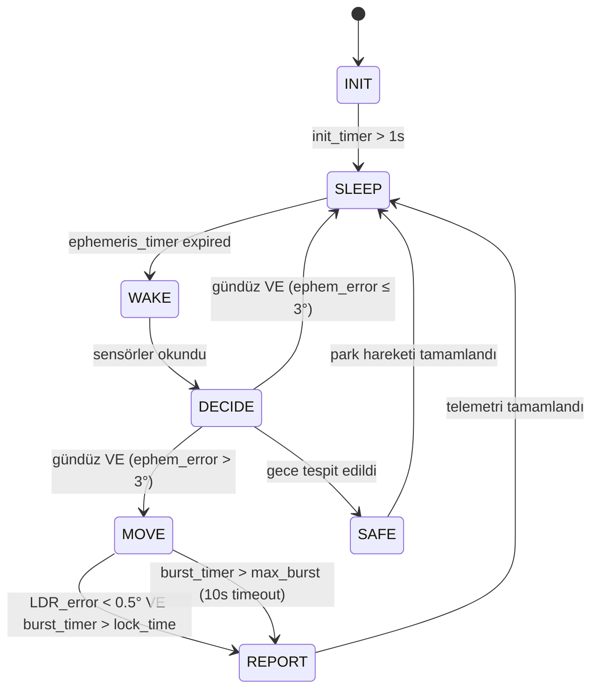

# 7-Durumlu Hibrit FSM Implementasyon Planı
## MATLAB Function + Stateflow Chart (İkisi Birden)

---

## Hedef

Mevcut SIL V1 mimarisine (`plant_step.m` → motor → LDR → `controller_step.m`) **7-durumlu hibrit FSM** entegre etmek. Kararlar:

- **Bulutlu gün:** Ephemeris Kör Takip (SEARCH kaldırıldı)
- **Gece parkı:** Sabah doğuş yönüne park (Ephemeris'ten hesaplanır)
- **Her iki format:** MATLAB Function (`fsm_hybrid.m`) + Stateflow Chart (`build_model_stateflow.m`)

---

## Mevcut SIL V1 Veri Akışı

```
[Simulink Clock] ──→ [plant_step.m] ──→ ldr_adc(4×1) ──→ [Unit Delay] ──→ [controller_step.m] ──→ pwm_pan/tilt ──→ [plant_step.m]
                         │                                                      │
                         ├─ sun_az, sun_el                                      ├─ error_extractor.m
                         ├─ panel_pan, panel_tilt                               └─ pi_step.m (×2)
                         └─ P_mppt, P_bus
```

**Eksikler:** FSM yok, gece/gündüz yok, duty-cycling yok, Ephemeris bilgisi kontrolcüye geçmiyor.

---

## Yeni Mimari (V2)

```
[Plant] ──→ ldr_adc(4)      ──→ [controller_step_v2.m]
        ──→ sun_az, sun_el   ──→         │
        ──→ panel_pan, tilt   ──→         │
                                          ├─ [1] error_extractor.m (LDR → e_pan, e_tilt, V_sum)
                                          ├─ [2] fsm_hybrid.m     (FSM mantığı → durum, hedef açılar)
                                          ├─ [3] pi_step.m (×2)   (PI kontrol → hız komutu)
                                          └─→ pwm_pan, pwm_tilt   (Motor komutları)
```

> [!IMPORTANT]
> Kritik fark: `controller_step_v2.m` artık plant'ten `sun_az`, `sun_el`, `panel_pan`, `panel_tilt` alıyor. Bu, Ephemeris tabanlı kör takip ve uyanma kararı için gerekli.

---

## Proposed Changes

### Controller Module

#### [NEW] [fsm_hybrid.m](file:///c:/Users/Kerem%20Bayer/Desktop/Mikro_Konferans/Mayıs_sonrası/SIL_Approach_V1/Digital_twin_v1/fsm_hybrid.m)

7-Durumlu FSM'nin tüm mantığını içeren fonksiyon. `%#codegen` uyumlu.

**7 Durum ve Geçişleri:**

| State | Enum | Motorlar | Açıklama |
|-------|------|----------|----------|
| `INIT` | 1 | Kapalı | İlk açılış, sensör kalibrasyonu (1 sn) |
| `SLEEP` | 2 | Kapalı | Düşük güç uyku, STM32 stop mode |
| `WAKE` | 3 | Kapalı | Sensörler okunur, Ephemeris hesaplanır |
| `DECIDE` | 4 | Kapalı | Gündüz/gece kararı, hareket gerekli mi? |
| `MOVE` | 5 | **Açık** | 2 fazlı: Ephemeris kör takip → LDR fine-tune |
| `REPORT` | 6 | Kapalı | Telemetri, logging |
| `SAFE` | 7 | **Park** | Gece parkı: sabah doğuşuna yönel |

**Geçiş Diyagramı:**



**FSM State Struct (Persistent):**
```matlab
FSM = struct( ...
    'state',          uint8(1),   ... % 1..7
    'init_timer',     0.0,        ... % [s]
    'sleep_timer',    0.0,        ... % [s]
    'burst_timer',    0.0,        ... % [s] - motor çalışma süresi
    'lock_timer',     0.0,        ... % [s] - hedefte kalma süresi
    'move_phase',     uint8(0),   ... % 0=coarse(ephem), 1=fine(LDR)
    'target_pan',     0.0,        ... % [deg] - hedef pan açısı
    'target_tilt',    0.0,        ... % [deg] - hedef tilt açısı
    'night_park_az',  90.0,       ... % [deg] - sabah doğuş azimutu
    'was_night',      false       ...
);
```

**Fonksiyon İmzası:**
```matlab
function [pwm_pan, pwm_tilt, fsm_state_out, debug] = ...
    fsm_hybrid(ldr_adc, sun_az, sun_el, panel_pan, panel_tilt, ...
               lat, lon, tz, start_doy, t_sim, dt)
```

**Parametre Tablosu (Fonksiyon İçinde Sabit):**

| Parametre | Değer | Birim | Açıklama |
|-----------|-------|-------|----------|
| `DEADBAND` | 3.0 | ° | Ephemeris uyanma eşiği |
| `LOCK_THRESH` | 0.5 | ° | LDR kilitlenme eşiği |
| `MIN_SLEEP` | 60 | s | Minimum uyku süresi |
| `MAX_BURST` | 10 | s | Maksimum motor çalışma |
| `LOCK_HOLD` | 2.0 | s | Kilitlenme onay süresi |
| `NIGHT_THRESH` | 0.30 | V | Gece eşiği (V_sum) |
| `COARSE_THRESH` | 2.0 | ° | Kör takip → LDR geçiş eşiği |

---

#### [NEW] [controller_step_v2.m](file:///c:/Users/Kerem%20Bayer/Desktop/Mikro_Konferans/Mayıs_sonrası/SIL_Approach_V1/Digital_twin_v1/controller_step_v2.m)

`controller_step.m`'in genişletilmiş versiyonu. FSM'yi çağırır, plant'ten gelen Ephemeris bilgisini FSM'ye iletir.

```matlab
function [pwm_pan, pwm_tilt, fsm_state_out, debug] = ...
    controller_step_v2(ldr_adc, sun_az, sun_el, panel_pan, panel_tilt, ...
                       lat, lon, tz, start_doy, t_sim, dt)
```

---

#### [MODIFY] [plant_step.m](file:///c:/Users/Kerem%20Bayer/Desktop/Mikro_Konferans/Mayıs_sonrası/SIL_Approach_V1/Digital_twin_v1/plant_step.m)

Plant'e değişiklik yok — zaten `sun_az`, `sun_el`, `panel_pan`, `panel_tilt` çıkışları mevcut. Sadece Simulink wiring'de bu çıkışları kontrolcüye bağlayacağız.

---

### Simulink Model

#### [NEW] [build_model_v2.m](file:///c:/Users/Kerem%20Bayer/Desktop/Mikro_Konferans/Mayıs_sonrası/SIL_Approach_V1/Digital_twin_v1/build_model_v2.m)

Yeni Simulink modeli oluşturan script. `plant_step.m` çıkışlarından `sun_az`, `sun_el`, `panel_pan`, `panel_tilt`'i kontrolcüye geri besleyen kapalı çevrim.

---

### Stateflow Chart

#### [NEW] [build_stateflow_fsm.m](file:///c:/Users/Kerem%20Bayer/Desktop/Mikro_Konferans/Mayıs_sonrası/SIL_Approach_V1/Digital_twin_v1/build_stateflow_fsm.m)

Stateflow Chart'ı programmatik olarak oluşturan script. Yuvarlak baloncuklar, oklar, geçiş koşulları — hepsi kod ile çizilir. Sonuç: `solar_tracker_SIL_stateflow.slx`

---

## Verification Plan

### Automated Tests
1. **Gündüz senaryosu (clear sky):**
   - `sun_el > 0`, `GHI = 800`
   - Beklenen: INIT → SLEEP → WAKE → DECIDE → MOVE → REPORT → SLEEP döngüsü
   - Motor akımı sadece MOVE state'te > 0

2. **Gece senaryosu:**
   - `sun_el < 0`, `GHI = 0`
   - Beklenen: DECIDE → SAFE (park hareketi) → SLEEP
   - Park sonrası panel_pan ≈ sabah doğuş azimutu

3. **Bulutlu gün senaryosu:**
   - `sun_el > 0`, `GHI = 50` (çok düşük)
   - Beklenen: LDR sinyal zayıf → MOVE state Ephemeris kör takipte kalır (fine-tune atlanır)

4. **Enerji karşılaştırması:**
   - 24 saatlik simülasyonda V1 (FSM'siz sürekli PI) vs V2 (7-durumlu FSM) toplam motor enerjisi

### Manual Verification
- Stateflow Chart'ta simülasyon sırasında aktif state'in vurgulanması (highlighting)
- Scope'larda FSM state geçişlerinin zaman çizelgesi
