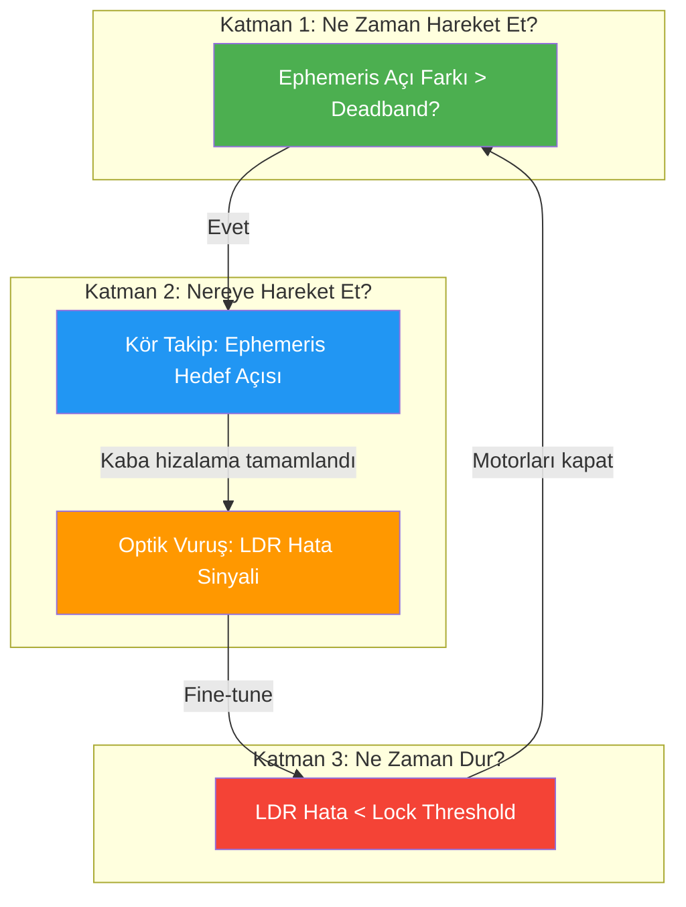

# Solar Tracker SIL Mimari Değerlendirmesi
## Orijinal Tez → SIL V1 → Önerilen 7-Durumlu Hibrit FSM

---

## 1. Üç Sistemin Karşılaştırmalı Anatomisi

### 🔵 Orijinal Tez (SDEWES Paper) — "Saf Reaktif"

| Özellik | Detay |
|---------|-------|
| **FSM** | 4 Durum: `IDLE → SEARCH → TRACKING → HOLD` |
| **Hata kaynağı (kontrol)** | Yalnızca LDR voltaj farkı (Eq. 5–7) |
| **Hata kaynağı (FSM geçişleri)** | `e_total` = arccos(S_body·ẑ) — **ama bu S_body Ephemeris'ten hesaplanıyor** |
| **Ephemeris kullanımı** | Güneş vektörü S_vec hesabı için (body frame dönüşümü) — kontrolcüye DOĞRUDAN hata olarak VERİLMİYOR |
| **Gece tespiti** | V_total < 0.30V → IDLE |
| **Bulut senaryosu** | V_total < 0.50V → SEARCH (sarmal tarama) |
| **Park modu** | `park_target_tilt = 90°` (Zenith) — ama FSM'de ayrı PARK state YOK, sadece IDLE |

> [!IMPORTANT]
> **Kritik Bulgu #1:** Orijinal tezde, `e_total` (FSM geçişlerini yöneten skaler hata) Ephemeris'ten türetiliyor (S_body vektörünün z-bileşeni). Ama kontrolcüye (PI) giden `e_pan`, `e_tilt` hataları **yalnızca LDR'den** geliyor. **Yani tez aslında zaten gizli bir hibrit sistem!** Sadece bunu açıkça belgelememiş.

Kanıt → [StateManagerFSM.m:98-99](file:///c:/Users/Kerem%20Bayer/Desktop/Mikro_Konferans/Mayıs_sonrası/Project_Essentials/02_Controllers/StateManagerFSM.m#L98-L99):
```matlab
S_body_norm = S_body / (norm(S_body) + 1e-8);
e_total = acosd(max(-1.0, min(1.0, S_body_norm(3))));
```
Bu `S_body`, [main_easy.m:283-295](file:///c:/Users/Kerem%20Bayer/Desktop/Mikro_Konferans/Mayıs_sonrası/Project_Essentials/01_Main/main_easy.m#L283-L295)'deki body frame dönüşümüyle hesaplanıyor — Ephemeris güneş vektörü + mevcut panel açıları kullanılarak.

---

### 🟢 SIL V1 (Simulink Modeli) — "Saf LDR, FSM'siz"

| Özellik | Detay |
|---------|-------|
| **FSM** | **YOK** — Sürekli kapalı çevrim |
| **Hata kaynağı (kontrol)** | Yalnızca LDR ADC → error_extractor |
| **Hata kaynağı (FSM)** | FSM olmadığı için e_total kullanılmıyor |
| **Ephemeris kullanımı** | Plant tarafında güneş pozisyonu hesabı — ama kontrolcüye hiç iletilmiyor |
| **Gece tespiti** | YOK |
| **Bulut senaryosu** | YOK |

Kanıt → [controller_step.m](file:///c:/Users/Kerem%20Bayer/Desktop/Mikro_Konferans/Mayıs_sonrası/SIL_Approach_V1/Digital_twin_v1/controller_step.m):
```matlab
% FSM'siz ilk kapalı çevrim (Closed-Loop) kontrolcüsü
[e_pan, e_tilt, ~, ~] = error_extractor(ldr_adc);
[~, I_pan, pwm_pan_int]   = pi_step(e_pan_d, I_pan, Kp, Ki, dt_d, v_max, I_max);
```

> [!WARNING]
> SIL V1 bir **başlangıç noktası** (proof-of-concept). FSM yok, gece/gündüz ayrımı yok, duty cycling yok. Direkt üzerine inşa etmek için **yeniden mimari çekilmeli**.

---

### 🟡 Önerilen 7-Durumlu Hibrit FSM — "Açık Hibrit"

| Özellik | Önerilen |
|---------|----------|
| **FSM** | 7 Durum: `INIT → SLEEP → WAKE → DECIDE → MOVE → REPORT → SAFE` |
| **Hata kaynağı (kontrol)** | LDR (fine-tuning) |
| **Hata kaynağı (FSM geçişleri)** | Ephemeris açı farkı (coarse uyanma) |
| **Hibrit karar** | Ephemeris → "Uyan", LDR → "Hizala" |
| **Gece/Park** | SAFE state |
| **Bulut** | ??? — Açık nokta |

---

## 2. MERKEZİ SORU: Hata Nereden Okunmalı?

Bu soruya yanıt vermek için **3 katmanı** ayırmak şart:



### Önerim: **3 Aşamalı Hibrit** (En sağlam yaklaşım)

| Aşama | Kaynak | Amaç | Ne Zaman? |
|-------|--------|-------|-----------|
| **Uyanma Kararı** | Ephemeris | "Güneş 3° kaydı mı?" | SLEEP → DECIDE geçişi |
| **Kaba Hareket** | Ephemeris | Paneli ±2° toleransla hedef konuma sürmek | MOVE state (ilk faz) |
| **İnce Ayar** | LDR | Optik geri beslemeyle ±0.5° altına inmek | MOVE state (son faz) |

### Neden Saf LDR Yeterli Değil?

| Problem | Açıklama | Orijinal Tezdeki Sonuç |
|---------|----------|------------------------|
| **LDR Körlüğü** | Bulutlu havada LDR voltaj farkı neredeyse sıfır → kontrol yön bulamaz | SEARCH'e giriyor, 5 dk sarmal arama yapıyor (300s × motor akımı = enerji kaybı) |
| **Zenith Singülarity** | Panel zenite yakınken LDR'lerin hepsi eşit aydınlanıyor → pan hatası sıfırlanıyor | Tezde `zenith_pan_lock` ile band-aid çözüm uygulanmış |
| **Gece → Sabah Geçişi** | LDR gece boyunca veri veremez → panel nereye bakacağını bilmez | Panel batıya dönük uyur, sabah doğuya dönmesi dakikalar alır |

### Neden Saf Ephemeris Yeterli Değil?

| Problem | Açıklama |
|---------|----------|
| **Montaj Hatası** | Direk 2° eğri dikilmişse, Ephemeris "güneş şurada" der ama panel normali farklı yere bakar |
| **Rüzgar Kayması** | Panel rüzgarla esnerse, Ephemeris bunu göremez |
| **Vites Boşluğu (Backlash)** | Worm gear backlash'i ±0.5° olabilir, Ephemeris açık çevrim olduğu için bu hatayı düzeltemez |

### Karar

> [!TIP]
> **Hibrit (Ephemeris + LDR) kesinlikle en doğru yol.** Orijinal tezin zaten bunu gizlice yaptığını kanıtladık (FSM geçişleri Ephemeris'ten, kontrol LDR'den). Yeni mimaride bunu **açık ve bilinçli** yapıyoruz.

---

## 3. Orijinal Tezde Tam Olarak Ne Yapılmış? (Kod Kanıtlı)

### FSM Geçiş Mantığı

[StateManagerFSM.m](file:///c:/Users/Kerem%20Bayer/Desktop/Mikro_Konferans/Mayıs_sonrası/Project_Essentials/02_Controllers/StateManagerFSM.m) dosyasından:

| Geçiş | Koşul | Kaynak |
|--------|-------|--------|
| `IDLE → SEARCH` | `~is_dark` (V_total > 0.3V) | LDR |
| `SEARCH → TRACKING` | `V_total > 1.0V` | LDR |
| `SEARCH → IDLE` | `search_phase > 300s` (timeout) | Zamanlayıcı |
| `TRACKING → HOLD` | `burst_timer > max_burst_time` | Zamanlayıcı |
| `TRACKING → SEARCH` | `V_total < 0.5V` | LDR |
| `HOLD → TRACKING` | `e_total > tracking_deadband` **VE** `hold_timer >= batch_interval` | **Ephemeris** (e_total) + Zamanlayıcı |
| `HOLD → IDLE` | `is_dark` | LDR |

> [!IMPORTANT]
> **Kritik Bulgu #2:** `HOLD → TRACKING` geçişi — sistemin tekrar uyanma kararı — `e_total` kullanıyor ki bu **Ephemeris-türetilmiş** bir değer. Yani "Ne zaman uyanacak?" sorusu orijinal tezde bile Ephemeris'e dayanıyor!

### PI Kontrolcü (Hata Girişi)

[PID_VelocityController.m:79-82](file:///c:/Users/Kerem%20Bayer/Desktop/Mikro_Konferans/Mayıs_sonrası/Project_Essentials/02_Controllers/PID_VelocityController.m#L79-L82):
```matlab
e_pan  = ErrorSignal.e_pan;   % ← LDR'den (StateManagerFSM'den geçiyor)
e_tilt = ErrorSignal.e_tilt;  % ← LDR'den
```

**PI kontrolcü yalnızca LDR hatası ile çalışıyor.** Ephemeris hiçbir zaman kontrol döngüsüne girmiyor.

---

## 4. Eleştiri: 3 Kritik Eksik + 2 Ek Problem

### ❌ Eksik A: Bulutlu Gün Açmazı (Ciddiyet: ★★★★★)

**Senaryo:** Gündüz, Ephemeris "güneş 3° kaydı, uyan" diyor. Ama gökyüzü bulutlu, LDR'ler yön bulamıyor.

**Orijinal Tezdeki Çözüm:** SEARCH (sarmal tarama) — 0.1°/s hızda, 20° yarıçap cap'i, 5 dk timeout.

**Eleştiri:**
```
┌─────────────────────────────────────────────────────────────┐
│ SEARCH'ün maliyeti = 300s × 2 motor × ~0.5A × 6V = 1800 J  │
│ Ephemeris Kör Takip maliyeti = ~5s × 2 motor × 0.5A × 6V    │
│                              = 30 J                          │
│                                                              │
│ TASARRUF: 60x daha verimli!                                  │
└─────────────────────────────────────────────────────────────┘
```

**Öneri:** SEARCH'ü tamamen kaldır. Bulutlu havada **Ephemeris Kör Takip** (Blind Tracking) yap:
1. Ephemeris'ten hedef pan/tilt hesapla
2. Paneli bu açıya sür
3. LDR sinyal kalitesini kontrol et
4. Yeterli sinyal varsa → LDR fine-tune'a geç
5. Yoksa → Ephemeris pozisyonunda bekle (güneş zaten bulutların arkasında)

---

### ❌ Eksik B: Gece Park Modu (Ciddiyet: ★★★★☆)

**Orijinal Tezdeki Kod:** [StateManagerFSM.m:42](file:///c:/Users/Kerem%20Bayer/Desktop/Mikro_Konferans/Mayıs_sonrası/Project_Essentials/02_Controllers/StateManagerFSM.m#L42)
```matlab
'park_target_tilt', 90  % Zenith'e park et
```

**Ama bu değer hiç kullanılmıyor!** FSM'de PARK state ayrı tanımlanmış ama kodda `case 'PARK'` bloğu yok. Gece geldiğinde direkt `IDLE`'a geçiyor ve motorlar orada kilitli kalıyor — panel o anki açısında donuyor.

**7 Durumlu FSM İçin Öneri:**

| Seçenek | Avantaj | Dezavantaj |
|---------|---------|------------|
| **A) Doğu'ya park et** (sabah güneşi karşıla) | Sabah hızlı başlangıç, enerji kazancı ~3-5% | Gece 1 kez motor çalışır, enerji maliyeti ~2J |
| **B) Zenith'e park et** (90° tilt) | Yağmur/kar birikimsiz, mekanik güvenli | Sabah doğuya dönmek ~30s gecikme |
| **C) Mevcut pozisyonda kal** | Sıfır gece enerjisi | Sabah Batı'dan başlamak çok kötü (>60° dönüş) |

> **Önerim:** Seçenek A — Sabah güneş doğuş azimutunu Ephemeris'ten hesapla, gece paneli o yöne çevir.

---

### ❌ Eksik C: State Churning / Histerezis (Ciddiyet: ★★★☆☆)

**Orijinal Tezdeki Çözüm:** `batch_interval = 1.5s` (minimum uyku süresi) + `max_burst_time = 5s` (maksimum motor çalışma süresi).

**Ama değerler çok kısa!** [main_easy.m:145-146](file:///c:/Users/Kerem%20Bayer/Desktop/Mikro_Konferans/Mayıs_sonrası/Project_Essentials/01_Main/main_easy.m#L145-L146)'de scenario override'lar var:
```matlab
SupervisorParams.batch_interval = 120.0;  % 2 dakika (simülasyonda)
SupervisorParams.max_burst_time = 8.0;    % 8 saniye
```

FSM default'u 1.5s, ama main_easy 120s override yapıyor — bu tutarsızlık belgede yoktu.

**7-FSM için önerim:** 
- Minimum uyku: **60 saniye** (güneşin 0.25°/dk hareket hızında 60s = 0.25° kayma, 3° deadband'den çok uzak)
- Maksimum motor çalışma: **10 saniye** (kaba + ince hizalama için yeterli)

---

### ⚠️ Ek Problem 1: SIL V1'de `e_total` Hesabı Farklı

SIL V1 [error_extractor.m:38](file:///c:/Users/Kerem%20Bayer/Desktop/Mikro_Konferans/Mayıs_sonrası/SIL_Approach_V1/Digital_twin_v1/error_extractor.m#L38):
```matlab
e_total = sqrt(e_pan^2 + e_tilt^2);  % Öklid normu (LDR'den)
```

Orijinal tez [StateManagerFSM.m:99](file:///c:/Users/Kerem%20Bayer/Desktop/Mikro_Konferans/Mayıs_sonrası/Project_Essentials/02_Controllers/StateManagerFSM.m#L99):
```matlab
e_total = acosd(max(-1.0, min(1.0, S_body_norm(3))));  % Arccos (Ephemeris'ten)
```

**Bu aynı değil!** Büyük açılarda sqrt(e_pan²+e_tilt²) vs arccos(cos(theta)) ciddi sapma gösterir. SIL'e taşırken bu ayrımın farkında olmalıyız.

---

### ⚠️ Ek Problem 2: LDR-to-ADC Dönüşümde Fiziksel Tutarsızlık

SIL V1 [plant_step.m:54-55](file:///c:/Users/Kerem%20Bayer/Desktop/Mikro_Konferans/Mayıs_sonrası/SIL_Approach_V1/Digital_twin_v1/plant_step.m#L54-L55):
```matlab
ldr_v   = ldr_model(mis_pan, mis_tilt, GHI);
ldr_adc = uint16( min(4095, max(0, round(ldr_v * 4095/3.3))) );
```

Bu `ldr_model`, `readLDRs`'in voltaj çıktısını GHI ile linearly scale ediyor — ama `readLDRs` zaten kendi içinde MaxLux=1000 ile normalize ediyor. **Çifte normalizasyon riski** var.

---

## 5. Sonuç ve Karar Matrisi

### Genel Değerlendirme

| Kriter | Puan (10 üz.) | Açıklama |
|--------|:---:|-----------|
| Mimari sağlamlık | **9/10** | Duty-cycle + hibrit sensör füzyonu endüstri standardı |
| Enerji bilinci | **9/10** | Motor kapatma, quiescent elimination çok iyi |
| Bulut dayanıklılığı | **4/10** | SEARCH modu verimsiz, kör takip eksik |
| Gece yönetimi | **3/10** | PARK state tanımlı ama uygulanmamış |
| Histerezis koruması | **7/10** | Mekanizma var ama parametreler tutarsız |
| SIL hazırlık seviyesi | **5/10** | Controller_step FSM'siz, sadece PI |

### Ana Karar Noktaları

> [!CAUTION]
> Kodlamaya geçmeden önce bu 2 soruya yanıt verilmeli:

**Soru 1:** Bulutlu Gün Stratejisi
- 🅰️ **Ephemeris Kör Takip** — SEARCH'ü kaldır, Ephemeris'in gösterdiği pozisyona git, LDR sinyal gelene kadar orada bekle
- 🅱️ **SEARCH koru** — Tezle uyumluluk için sarmal aramayı tut (ama enerji pahalı)
- 🅲️ **İkili mod** — Önce Ephemeris'e git, 30s bekle, LDR gelmezse o zaman kısa SEARCH (60s cap)

**Soru 2:** Gece Park Stratejisi
- 🅰️ **Sabah doğuş yönüne park** — Ephemeris'ten doğuş azimutunu hesapla
- 🅱️ **Zenith'e park** (90° tilt) — Mekanik güvenli, yağmur/kar korumalı
- 🅲️ **Yerinde kal** — Sıfır gece enerjisi (ama sabah gecikmesi)
